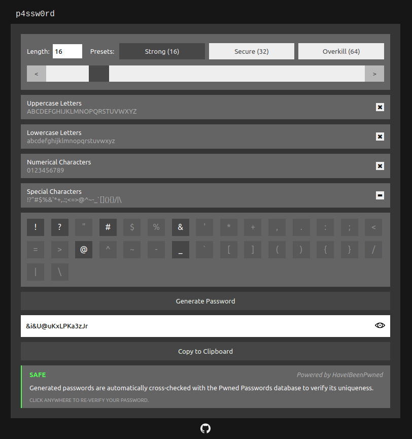

# p4ssw0rd - A Simple Password Generator

This app is currently live and hosted on Netlify -- access it by going to https://p4ssw0rd.netlify.app/.

This app was created by [@kurtdeleon](https://github.com/kurtdeleon) as a hobby project so he could practice making stuff with Typescript. The author recommends [Diceware](https://www.rempe.us/diceware/#eff) instead for non-master passwords.

Bootstrapped with [Create React App](https://github.com/facebook/create-react-app).
